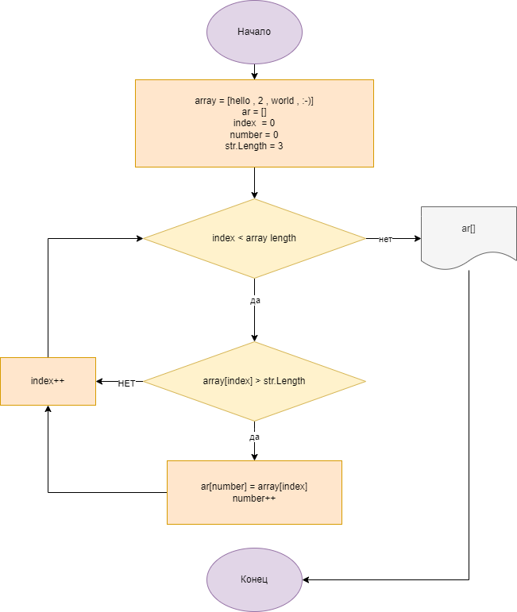

## Итоговая проверочная работа.
1. Создал репазиторий на GitHub
2. Создание блок схемы для решения поставленой задачи:

3. Создал фаил "README"
4. Написал программу, решающую поставленую задачу:
* написал функцию для заполнения массва строками пользователем 
* написал функцию для проверки и переноса подходящих строк в другой массив
5. Заполнил фаил "REDME"